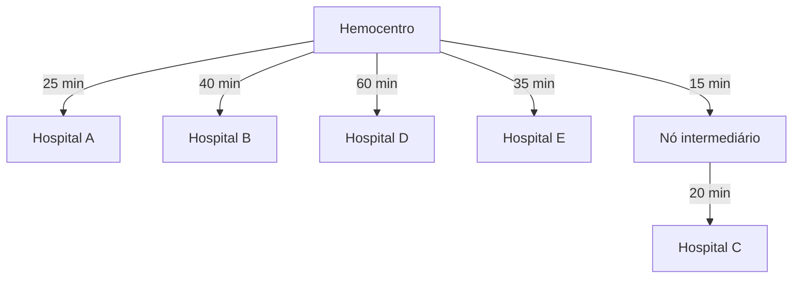

# Escopo do Grafo — HemoFlow (AED)

> Documento de definição do grafo de roteirização do projeto HemoFlow, referente à Semana 2 do cronograma. Define o tamanho, a estrutura e as regras do grafo usado no cálculo de rotas de distribuição.

---

## 1. Objetivo do Grafo

Representar a rede de distribuição entre o hemocentro e os hospitais atendidos, permitindo calcular a **rota de menor tempo** entre a origem (hemocentro) e o destino (hospital solicitante), respeitando o limite de tempo da cadeia fria.

---

## 2. Definição de Nós e Arestas

### Nós (vértices)
Cada nó representa uma unidade física da rede:
- **1 Hemocentro** — nó central, único ponto de origem das entregas.
- **5 a 6 Hospitais** — nós folha, pontos de destino das entregas.

### Arestas
Cada aresta representa uma via/rota entre duas unidades, com peso associado:
- **Peso** = tempo estimado de viagem, em minutos.
- Arestas podem ser **direcionadas ou não-direcionadas**. Optamos pela **não-direcionadas**, já que a via é a mesma nos dois sentidos, exceto se houver justificativa de trânsito.
- Podem existir **1 a 2 rotas intermediárias** (nós de passagem, não necessariamente hospitais) para exercitar caminhos com mais de uma aresta.

---

## 3. Tamanho do Grafo

| Item | Quantidade | Justificativa |
|---|---|---|
| Nós totais | 6 a 8 | 1 hemocentro + 5-6 hospitais + até 2 nós intermediários opcionais |
| Arestas | ~8 a 12 | Conexões diretas hemocentro-hospital, mais eventuais conexões intermediárias |

---

## 4. Algoritmo de Caminho Mínimo

- **Algoritmo escolhido:** Dijkstra.
- **Motivo:** todos os pesos das arestas são positivos, e o grafo é pequeno.
- **Entrada:** nó de origem (Hemocentro) e nó de destino (Hospital solicitante).
- **Saída:** sequência de nós do caminho e o tempo total estimado.

---

## 5. Restrição de Cadeia Fria

- Cada Hemocomponente possui um **limite máximo de tempo de transporte** antes de comprometer a temperatura (ex.: 120 minutos).
- Após o cálculo da rota, o sistema compara o tempo total estimado com esse limite:
  - Se **dentro do limite** → rota aprovada para entrega.
  - Se **fora do limite** → sistema sinaliza o risco antes da confirmação (não bloqueia necessariamente, mas alerta).

---

## 6. Representação em Grafo (Mermaid)

Exemplo ilustrativo da estrutura (nomes fictícios, apenas para visualização do escopo):



---

## 7. Estrutura de Dados

Representação como **lista de adjacência**, adequada para grafos pequenos e esparsos como este:

```java
class Grafo {
    Map<String, List<Aresta>> adjacencias = new HashMap<>();

    void adicionarAresta(String origem, String destino, int peso) {
        adjacencias.computeIfAbsent(origem, k -> new ArrayList<>())
                   .add(new Aresta(destino, peso));
    }
}

class Aresta {
    String destino;
    int peso; // tempo estimado em minutos

    Aresta(String destino, int peso) {
        this.destino = destino;
        this.peso = peso;
    }
}
```

A fila de prioridade usada no Dijkstra pode ser implementada com `PriorityQueue<Nó>` do próprio Java, ordenada pela menor distância acumulada — a mesma estrutura de fila de prioridade já usada na priorização FEFO do estoque, reaproveitando o mesmo conceito de AED em duas partes do sistema.

---
