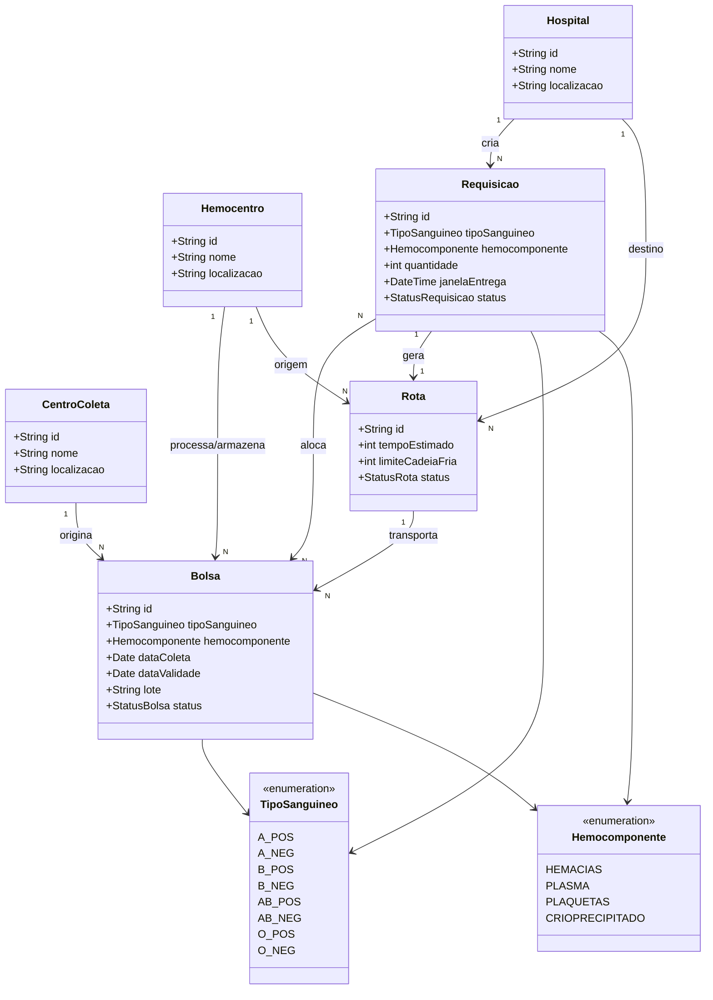

# Modelo de Domínio — HemoFlow

> Documento de modelagem de domínio (POO) do projeto HemoFlow, referente à Semana 2 do cronograma. Descreve as entidades principais, seus atributos e os relacionamentos entre elas.

---

## 1. Entidades e Atributos

### TipoSanguineo (Enum)
Representa a combinação ABO/Rh.
- `valor`: A+, A-, B+, B-, AB+, AB-, O+, O-

### Hemocomponente (Enum)
Representa o tipo de componente derivado do sangue.
- `valor`: Hemácias, Plasma, Plaquetas, Crioprecipitado

### Bolsa
Unidade individual de hemocomponente em estoque.
- `id`: identificador único
- `tipoSanguineo`: TipoSanguineo
- `hemocomponente`: Hemocomponente
- `dataColeta`: Data
- `dataValidade`: Data
- `lote`: String
- `status`: Enum (Disponível, Alocada, Em trânsito, Entregue, Descartada)

### CentroColeta
Unidade de origem das doações.
- `id`: identificador único
- `nome`: String
- `localizacao`: String (nó do grafo)

### Hemocentro
Unidade de processamento e controle central de estoque.
- `id`: identificador único
- `nome`: String
- `localizacao`: String (nó central do grafo)

### Hospital
Unidade solicitante de hemocomponentes.
- `id`: identificador único
- `nome`: String
- `localizacao`: String (nó do grafo)

### Requisicao
Pedido de hemocomponente feito por um hospital.
- `id`: identificador único
- `hospitalSolicitante`: Hospital
- `tipoSanguineo`: TipoSanguineo
- `hemocomponente`: Hemocomponente
- `quantidade`: Integer
- `janelaEntrega`: Data/Hora
- `status`: Enum (Pendente, Aguardando estoque, Alocada, Em trânsito, Entregue)

### Rota
Trajeto calculado entre o hemocentro e o hospital para uma entrega.
- `id`: identificador único
- `origem`: Hemocentro
- `destino`: Hospital
- `tempoEstimado`: Integer (minutos)
- `limiteCadeiaFria`: Integer (minutos)
- `status`: Enum (Calculada, Em andamento, Concluída)

---

## 2. Relacionamentos

- Uma **Bolsa** é originada em um **CentroColeta** e processada por um **Hemocentro** (1 Hemocentro → N Bolsas).
- Um **Hospital** cria N **Requisições**.
- Uma **Requisição** pode ser atendida por uma ou mais **Bolsas** compatíveis (N:N, controlado pela alocação).
- Uma **Requisição** alocada gera uma **Rota** entre o Hemocentro (origem) e o Hospital (destino) (1:1 por entrega).
- Uma **Rota** carrega uma ou mais **Bolsas** em trânsito.

---

## 3. Diagrama de Classes (Mermaid)

---

## 4. Regras de Negócio Associadas

- **Compatibilidade ABO/Rh:** a alocação de uma Bolsa para uma Requisição só é permitida se o `tipoSanguineo` da bolsa for compatível com o `tipoSanguineo` solicitado, segundo a matriz didática do projeto.
- **FEFO (First Expired, First Out):** entre bolsas compatíveis, a de `dataValidade` mais próxima deve ser priorizada na alocação.
- **Cadeia fria:** o `tempoEstimado` de uma Rota não deve ultrapassar o `limiteCadeiaFria` definido para o hemocomponente transportado.
- **Baixa de estoque:** ao confirmar uma alocação, o status da Bolsa muda para "Alocada" e ela deixa de estar disponível para novas requisições.

---

## 5. Observações de Escopo

- Este modelo cobre apenas as entidades essenciais para o fluxo principal (Semana 2). Atributos e relações adicionais (ex.: histórico de alocações, usuários/permissões) podem ser incorporados em entregas futuras, conforme o backlog de histórias de usuário.
- Dados sintéticos apenas — nenhuma entidade armazena informações reais de doadores ou pacientes (LGPD).
